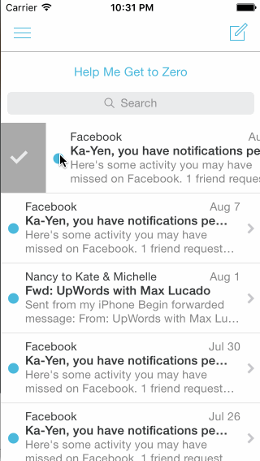

## Mailbox

The purpose of this homework is to leverage animations and gestures to implement more sophisticated interactions. We're going to use the techniques from this week to implement the Mailbox interactions.

Time spent: 5 hrs

### Features

#### Required

- [X] On dragging the message left:
  - [X] Initially, the revealed background color should be gray.
  - [X] As the reschedule icon is revealed, it should start semi-transparent and become fully opaque. If released at this point, the message should return to its initial position.
  - [X] After 60 pts, the later icon should start moving with the translation and the background should change to yellow.
    - [X] Upon release, the message should continue to reveal the yellow background. When the animation it complete, it should show the reschedule options.
  - [X] After 260 pts, the icon should change to the list icon and the background color should change to brown.
    - [X] Upon release, the message should continue to reveal the brown background. When the animation it complete, it should show the list options.

- [X] User can tap to dismiss the reschedule or list options. After the reschedule or list options are dismissed, you should see the message finish the hide animation.
- [X] On dragging the message right:
  - [X] Initially, the revealed background color should be gray.
  - [X] As the archive icon is revealed, it should start semi-transparent and become fully opaque. If released at this point, the message should return to its initial position.
  - [X] After 60 pts, the archive icon should start moving with the translation and the background should change to green.
    - [X] Upon release, the message should continue to reveal the green background. When the animation it complete, it should hide the message.
  - [X] After 260 pts, the icon should change to the delete icon and the background color should change to red.
    - [X] Upon release, the message should continue to reveal the red background. When the animation it complete, it should hide the message.

#### Optional

- [X] Panning from the edge should reveal the menu.
  - [X] If the menu is being revealed when the user lifts their finger, it should continue revealing.
  - [X] If the menu is being hidden when the user lifts their finger, it should continue hiding.
- [ ] Tapping on compose should animate to reveal the compose view.
- [ ] Tapping the segmented control in the title should swipe views in from the left or right.
- [ ] Shake to undo.

Please list two areas of the assignment you'd like to **discuss further with your peers** during the next class (examples include better ways to implement something, how to extend your app in certain ways, etc):

1. Best practices for organizing many conditionals/efficient ways of writing logic
2. Understand better how to call different gestures (why is implementation of UIPan different from UIEdgePan?)

### Video Walkthrough 

GIF created with [LiceCap](http://www.cockos.com/licecap/).

## Notes

A few times, the order in which I wrote conditionals would create glitches or problems when running the app, so I had to reorganize. Also, just managing a lot of code in one file became really messy.
